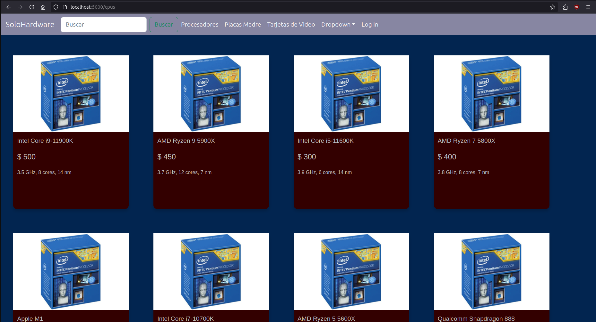

# solohardware

A fullstack web application of a hardware store.



## Dependencies

The application is written with the help of MERN stack, so the main dependencies are:

* MongoDB
* Express
* React
* NodeJS

Afterwards, dependencies for the front and backend are needed.

Change directory into *backend* and *frontend* and run

```
npm install
```

on each.


**Note**: Application is still under development.